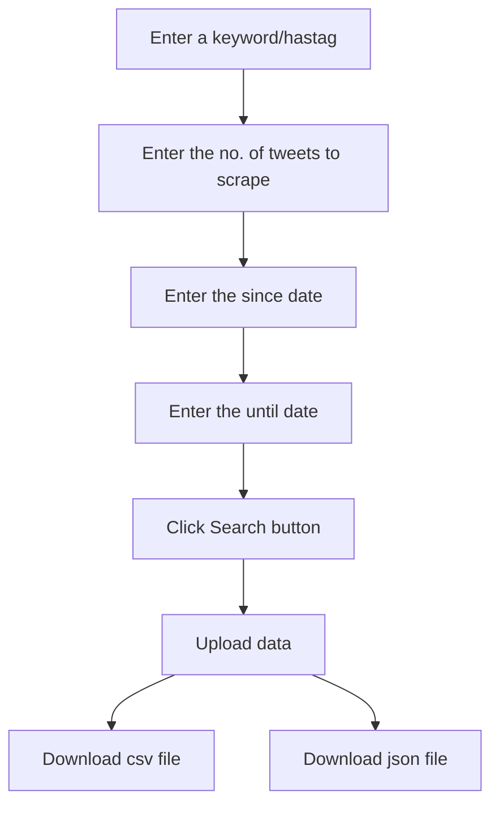

# Twitter scrapping project
The webpage allows one to search for tweets in twitter by entering a keyword or hastag. Also, one can select the number of tweets to be fetched. And additionally, can also provide the time span. Once the tweets are fetched, the webpages allows data upload to MongoDB and provide options for downloading the data in csv/json format.
*Cool, innit?*

Four libraries are used for achieving the goal. Find them below.

```python
import snscrape.modules.twitter as scrapetwit
import pandas as pd
from pymongo import MongoClient
import streamlit as st
```
---
## Libraries

**snscrape** is a scraper for social networking services (SNS). It scrapes things like user profiles, hashtags, or searches and returns the discovered items. In this project, tweets are scraped from Twitter using this library. Users can provide the following inputs for scraping data.

- Keyword/Hashtag
- No. of tweets to scrape
- Since date
- Until date

---
**Pandas** is a very common package for data manipulation and this project demanded its help for storing the scraped tweets in a dataframe.

---
**PyMongo** is an another popular package for working with MongoDB. In this project, PyMongo is used for establishing connection with a local database. Using the objects from PyMongo, a database 'Twitter' will be automatically created in the local connection. Once the data upload is initiated, a new collection 'tweet' will be created and the data will be stored into it as documents.

---

**Streamlit** is an open source app framework in Python language. It helps us create web apps for data science and machine learning in a short time. The objects from this library are predominantly used. The following items are configured using streamlit.

- Title
- Image
- Sidebar
- Inputs
- Buttons
- Upload/Download buttons
- Balloons
- Display content

---
## Functions

Four functions are used in this project for the following purposes.
**1. scrape_tweet** 

**Input:** Query, No. of tweets, Since date, and until date

**Action:** 
1. Passes the input to TwitterSearchScraper which returns tweet url as output
2. Date, ID, Content, User, Reply count, Retweet count, Language, Like count will be fetched from the url and stored in a list
3. Then, the list will be converted to a dataframe

>**Output:** Dataframe will be returned


**2. upload_data**

**Input:** Dataframe from the scrape_tweet function

**Action:** 
1. Creates a new collection 'tweet'
2. Converts the dataframe to dictionary in records format
3. Inserts the dictionary items as documents to the tweet collection
 
>**Output:** Returns nothing


**3. convert_df_csv**

**Input:** Dataframe from the scrape_tweet function

>**Output:** Returns a csv file


**4. convert_df_json**

**Input:** Dataframe from the scrape_tweet function

>**Output:** Returns a json file

---
## User workflow


---
## Instructions
Kindly follow the below instructions for using the twitter scrapping webpage.
1. Download the Twitter scrapping.py to your local machine.
2. Navigate to the downloaded page, and right-click on the screen, and select 'Open in Terminal'
3. Once the terminal window opens type the following command.

```powershell
streamlit run "Twitter scraping.py"
```
---

💙💙💙Thank you for reading this!💙💙💙


